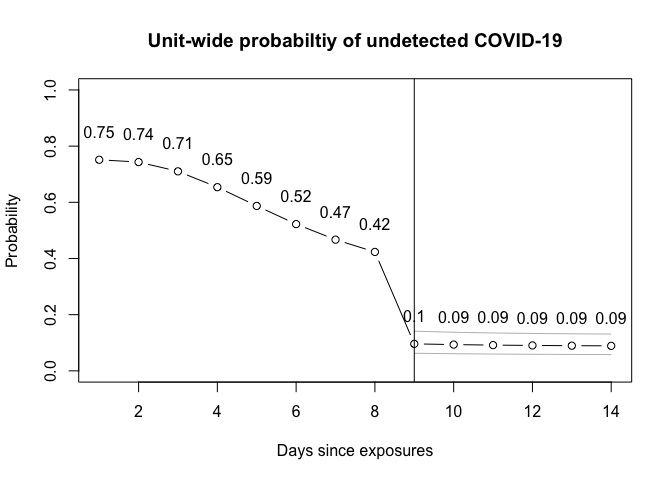

<!-- README.md is generated from README.Rmd. Please edit that file -->

# R package: covidprobability

<!-- badges: start -->

[](https://lifecycle.r-lib.org/articles/stages.html)
<!-- badges: end -->

This package provides the functions, data and documentation that support
a calculator to determine the probability of an undetected COVID-19
infection in a setting/unit after a potential exposure, testing, and
when there are no symptomatic cases. For a detailed explanation of the
rationale and implementation, please see the
[vignette](https://eebrown.github.io/covidprobability/articles/unit-example.html).

## Shiny

An [interactive web app](http://covid.eebc.ca) of this calculator is
available.

## Installation

You can install the latest CRAN version of covidprobability from with:

``` r
install.packages("covidprobability")
```

You can install the latest version of covidprobability from
[Github](https://github.com/eebrown/covidprobability) with:

``` r
devtools::install.github("eebrown/covidprobability")
```

### Disclaimer

This is an exploratory model and may contain errors. Please see the
[vignette](https://eebrown.github.io/covidprobability/articles/unit-example.html)
for assumptions and limitations of the model. It should not be relied
upon for clinical decisions.

## Example

``` r

library(covidprobability)

test_n <- unit_probability(test_day = 9, pre0 =  0.13, sens = sens, spec = 1, 
                           asympt = 0.279, days = 14, mu = 1.63, sigma = 0.5, 
                           n = 10)
```


